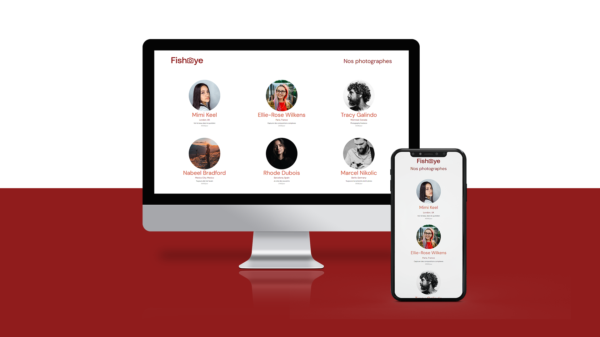

# Openclassrooms - **Projet 6** - Fisheye

## Description

Fisheye est une plateforme où les utilisateurs peuvent découvrir des photographes professionnels et leurs œuvres. Les utilisateurs peuvent aimer des photos et des vidéos, et naviguer à travers les profils et portfolios des photographes.

## Table des matières

- [Openclassrooms - **Projet 6** - Fisheye](#openclassrooms---projet-6---fisheye)
  - [Description](#description)
  - [Table des matières](#table-des-matières)
  - [Screenshot](#screenshot)
  - [Fonctionnalités](#fonctionnalités)
  - [Installation](#installation)
  - [Utilisation](#utilisation)
    - [Page d'accueil](#page-daccueil)
    - [Page du photographe](#page-du-photographe)
    - [Lightbox](#lightbox)
    - [Formulaire de contact](#formulaire-de-contact)
  - [Structure du projet](#structure-du-projet)
  - [Technologies utilisées](#technologies-utilisées)
  - [Liens](#liens)

## Screenshot



## Fonctionnalités

> -   Affichage de la liste des photographes avec leurs détails.
> -   Visualisation des profils détaillés et des portfolios des photographes.
> -   Possibilité d'aimer des photos et des vidéos.
> -   Filtrage des médias par popularité, date ou titre.
> -   Interface accessible avec support de la navigation au clavier.
> -   Fonctionnalité de lightbox pour afficher les médias en plein écran.
> -   Formulaire de contact pour que les utilisateurs puissent contacter les photographes.

## Installation

Suivez ces étapes pour installer et configurer le projet localement :

1.  Clonez le dépôt GitHub
    ```sh
    [git clone https://github.com/stephanievanoverberghe/ocr-p6-fisheye.git
    ```
2.  Installer les dépendances

    ```sh
    npm install
    ```

3.  Script npm

    ```json
    {
        "scripts": {
            "sass": "sass -w sass:css"
        }
    }
    ```

4.  Lancer le serveur local

    ```sh
    npm start
    ```

5.  Compiler les fichiers Sass

    ```sh
    npm run sass
    ```

## Utilisation

### Page d'accueil

> -   Affiche la liste des photographes
> -   Cliquez sur le nom ou la photo d'un photographe pour voir son profil

### Page du photographe

> -   Affiche la biographie et le portfolio du photographe.
> -   Aimez les photos et vidéos en cliquant sur l'icône en forme de cœur.
> -   Utilisez le menu déroulant pour filtrer les médias.
> -   Cliquez sur un média pour l'ouvrir dans une lightbox.

### Lightbox

> -   Naviguez à travers les médias en utilisant les touches fléchées ou les boutons de navigation.
> -   Fermez la lightbox avec le bouton de fermeture ou la touche Échap.

### Formulaire de contact

> -   Ouvrez le formulaire de contact en cliquant sur le bouton "Contactez-moi".
> -   Remplissez le formulaire et envoyez-le pour contacter le photographe.

## Structure du projet

```
fisheye/
├── assets/
├── css/
├── data/
│   └── photographers.json
├── js/
│   ├── api/
│   ├── factories/
│   ├── models/
│   ├── strategies/
│   ├── templates/
│   ├── utils/
│   ├── homeApp.js
│   └── photographerApp.js
├── sass/
├── index.html
├── photographer.html
└── README.md
```

## Technologies utilisées


 <br>


 <br>


## Liens

-   Code du site : [GitHub](https://github.com/stephanievanoverberghe/ocr-p6-fisheye)
-   Site en direct : [GitHub Pages](https://stephanievanoverberghe.github.io/ocr-p6-fisheye/)
